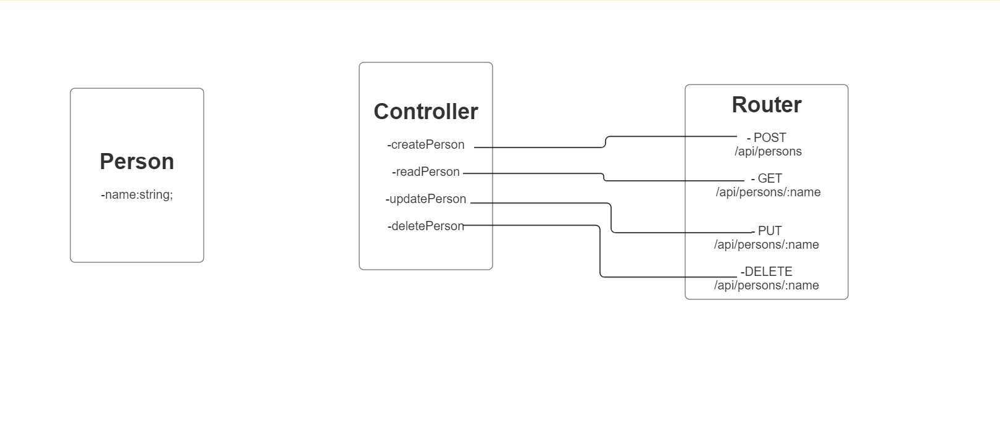

# API Documentation

This document provides details about the endpoints and usage
of the CRUD API for managing persons.

## Base URL

The base URL for all API endpoints is:
`https://hg-two.onrender.com/api`

## Endpoints

### Get all people

**Endpoint:** `GET /`

**Description:** Get all people in database.

**Reqponse (200)Ok:**

```json
[

  {
    "name": "John Doe2",
    "_id: "....
  },
  {
    "name": "John Doe",
    "_id: "....
  },
]
```

### Create a Person

**Endpoint:** `POST /`

**Description:** Add a new person to the database.

**Request:**

```json
{
  "name": "John Doe"
}
```

**Response (201) created:**

```json
{
  "name": "John Doe",
  "_id": "......"

```

**Response (400 Bad Request):**

```json
{
  "error": "Name must be a string"
}
```

# Read a Person by id

**Endpoint:** GET /:user_id

**Description:** Fetch details of a person by their:user_id.

**Response (200 OK):**

```json
{
  "name": "John Doe",
  "_id": "......"
}
```

**Response (404 Not Found):**

```json
{
  "error": "Person not found"
}
```

# Update a Person by id

**Endpoint:** PUT /:user_id

**Description:** Modify details of an existing person by
their user_id

**Request:**

```json
{
  "name": "Updated Name"
}
```

**Response (200 OK):**

```json
{
  "name": "Updated Name",
  "_id": "......"
}
```

**Response (404 Not Found):**

```json
{
  "error": "Person not found"
}
```

**Response (400 Bad request):**

```json
{
  "error": "Name must be a string"
}
```

# Delete a Person by id

**Endpoint:** DELETE /:user_id

**Description:** Remove a person by their :user_id.

**Response (204 No Content):**

**Response (404 Not Found):**

```json
{
  "error": "Person not found"
}
```

# Error Handling

If an endpoint encounters an error, it will respond with an
appropriate status code and an error message in the response
body.

# Data Validation

The API enforces basic data validation to ensure that the
"name" field is a string.

# Usage Example

Here's an example of how to use the API in a JavaScript
application:

```javascript
// Fetch a person by id
fetch("https://hg-two.onrender.com/api/John%20Doe")
  .then((response) => response.json())
  .then((data) => console.log(data))
  .catch((error) => console.error(error));
```

# Notes

This API uses MongoDB as the backend database.

# UMI Diagram


